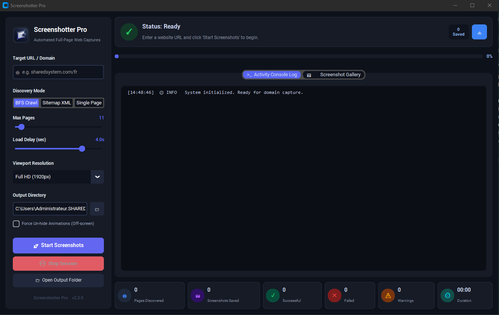

<div align="center">
  
  <h1>Screenshotter Pro</h1>
  <p><b>Automated High-Resolution Full-Page Website Screenshot Application</b></p>
</div>

---

## 🖼️ Application Interface



---

## ✨ Features

- 🎨 **Modern Dark GUI**: Built with CustomTkinter featuring dark design aesthetics.
- 🚀 **Multi-Threaded Async Engine**: Powered by Playwright Chromium for accurate full-page rendering.
- 🌐 **3 Page Discovery Modes**:
  - **BFS Crawl**: Recursive domain crawler for internal links.
  - **Sitemap XML**: Automatic parser for `sitemap.xml` & `sitemap_index.xml`.
  - **Single Page**: Targeted capture of specific URLs.
- 📊 **6 Live Metric Cards**: Real-time tracking of discovered pages, saved screenshots, successes, failures, warnings, and session duration.
- 📜 **Live Activity Console & Gallery**: Live log output stream and an interactive screenshot thumbnail gallery grid with quick actions.
- 📜 **Auto-Scroll Engine**: Dynamic scrolling to trigger lazy-loaded images, web fonts, and off-screen elements with optional animation un-hiding.
- 💻 **CLI & GUI Support**: Launch interactively or automate in headless server environments.
- 📦 **Standalone Windows `.exe` Ready**: PyInstaller configuration included to package as a portable binary.

---

## 🛠️ Installation & Setup

### 1. Install Python Dependencies
```cmd
pip install -r requirements.txt
```

### 2. Install Playwright Chromium Engine
```cmd
python -m playwright install chromium
```

---

## 🚀 How to Run

### Launch Graphical User Interface (GUI)
```cmd
python website_screenshotter.py
```

### Run via Command Line (CLI)
```cmd
python website_screenshotter.py --cli example.com --max-pages 10 --delay 1.5 --output-dir screenshots
```

#### CLI Arguments:
| Option | Description | Default |
| :--- | :--- | :--- |
| `domain` | Target domain or URL | Required |
| `--cli` | Execute in CLI mode without GUI | `False` |
| `--max-pages` | Max number of pages to discover & capture | `50` |
| `--delay` | Page load delay (in seconds) | `1.5` |
| `--unhide-animations` | Force un-hide off-screen animated elements | `False` |
| `--output-dir` | Target folder for saved PNG screenshots | `screenshots` |

---

## 📦 Building Standalone `.exe`

To compile Screenshotter Pro into a single portable Windows executable (`dist\ScreenshotterPro.exe`):

1. **Install PyInstaller & Requirements:**
   ```cmd
   pip install pyinstaller -r requirements.txt
   ```

2. **Build Executable:**
   ```cmd
   pyinstaller ScreenshotterPro.spec
   ```

The standalone executable will be output to:
📁 **`dist\ScreenshotterPro.exe`**

---

## 📄 Requirements Overview

Listed in [`requirements.txt`](file:///c:/Users/Administrateur.SHARED-PC-05/Desktop/website-full-page-screenshotter/requirements.txt):
- `customtkinter>=5.2.0`
- `pillow>=10.0.0`
- `playwright>=1.40.0`
- `requests>=2.31.0`
- `beautifulsoup4>=4.12.0`
- `pyinstaller>=6.0.0`
