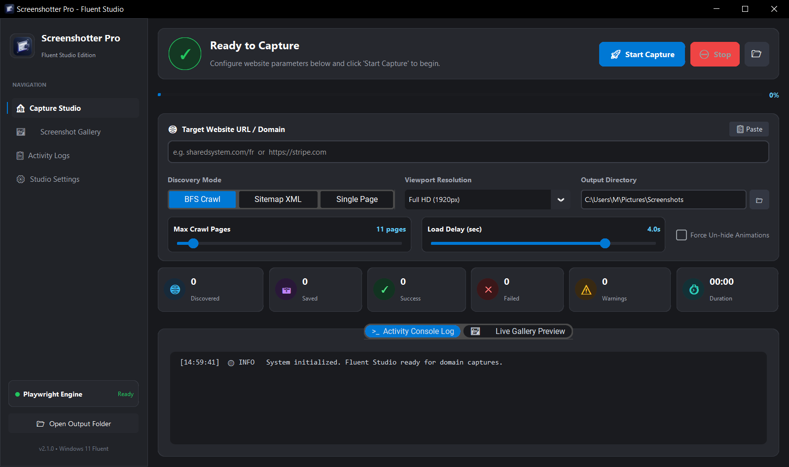

<div align="center">
  
  <h1>Screenshotter Pro</h1>
  <p><b>Windows 11 Fluent Studio — Automated High-Resolution Full-Page Web Captures</b></p>
  <p>
    <a href="#-english">English</a> •
    <a href="#-français">Français</a> •
    <a href="#-العربية">العربية</a>
  </p>
</div>

---

<div align="center">
  
</div>

---

## 🇬🇧 English

**Screenshotter Pro** is an automated full-page web screenshot application featuring a sleek **Windows 11 Fluent Design** interface and an asynchronous **Playwright Chromium** engine.

### ✨ Features
- 🪟 **Fluent Design UI**: Modern dark theme with Mica/Acrylic card elevation, active sidebar pills, and live status orb.
- 🚀 **Playwright Engine**: Accurate full-page rendering with intelligent auto-scrolling for lazy-loaded media and web fonts.
- 🌐 **3 Capture Modes**:
  - **BFS Crawl**: Recursively discovers and captures internal domain links.
  - **Sitemap XML**: Automatically parses `sitemap.xml` and `sitemap_index.xml`.
  - **Single Page**: Instant capture of a specific URL.
- 📊 **Live Analytics & Gallery**: 6 real-time metric cards, interactive screenshot preview gallery, and live console stream.
- 📁 **Smart Storage**: Automatically saves screenshots directly into your Windows `Pictures/Screenshots` folder.
- 📦 **Standalone Portable `.exe`**: Easily compile into a single self-contained Windows executable.

### 🚀 Quick Start

1. **Install Dependencies:**
   ```bash
   pip install -r requirements.txt
   python -m playwright install chromium
   ```

2. **Launch the App:**
   ```bash
   python website_screenshotter.py
   ```

3. **Run via CLI (Headless Mode):**
   ```bash
   python website_screenshotter.py --cli example.com --max-pages 10 --delay 1.5
   ```

4. **Build Standalone `.exe`:**
   ```bash
   python build_exe.py
   ```
   *Output executable: `dist/ScreenshotterPro.exe`*

---

## 🇫🇷 Français

**Screenshotter Pro** est une application professionnelle de capture d'écran complète de pages web en haute résolution, dotée d'une interface **Windows 11 Fluent Design** et d'un moteur asynchrone **Playwright Chromium**.

### ✨ Fonctionnalités clés
- 🪟 **Interface Fluent Design** : Thème sombre moderne avec surfaces acryliques, indicateurs de navigation et orbe d'état dynamique.
- 🚀 **Moteur Playwright** : Rendu pleine page haute fidélité avec défilement intelligent pour charger les éléments différés (lazy-loading) et polices web.
- 🌐 **3 modes de découverte** :
  - **Exploration BFS** : Analyse récursive de tous les liens internes d'un domaine.
  - **Sitemap XML** : Extraction automatique des URLs depuis `sitemap.xml`.
  - **Page unique** : Capture ciblée d'une URL spécifique.
- 📊 **Statistiques & Galerie en direct** : 6 cartes de métriques en temps réel, galerie de prévisualisation et console d'activité intégrée.
- 📁 **Rangement automatique** : Création et sauvegarde automatique dans le dossier Windows `Images/Screenshots`.
- 📦 **Exécutable autonome** : Compilation simple en un fichier `.exe` portable sans installation requise.

### 🚀 Démarrage rapide

1. **Installer les dépendances :**
   ```bash
   pip install -r requirements.txt
   python -m playwright install chromium
   ```

2. **Lancer l'application :**
   ```bash
   python website_screenshotter.py
   ```

3. **Utiliser en ligne de commande (CLI) :**
   ```bash
   python website_screenshotter.py --cli example.com --max-pages 10 --delay 1.5
   ```

4. **Compiler le fichier `.exe` :**
   ```bash
   python build_exe.py
   ```
   *Exécutable généré : `dist/ScreenshotterPro.exe`*

---

## 🇸🇦 العربية

<div dir="rtl">

**Screenshotter Pro** هو برنامج احترافي لالتقاط صفحات الويب كاملة وبدقة فائقة، يتميز بواجهة عصرية مبنية بنمط **Windows 11 Fluent Design** ومدعوم بمحرك **Playwright Chromium** القوي وغير المتزامن.

### ✨ الميزات الرئيسية
- 🪟 **واجهة Fluent Design عصرية**: تصميم داكن راقٍ مع بطاقات زجاجية ثلاثية الأبعاد، مؤشرات تنقل ذكية، ومؤشر حالة تفاعلي بالوقت الفعلي.
- 🚀 **محرك Playwright متقدم**: التقاط كامل للصفحة بدقة عالية مع تمرير ذكي لتحميل الصور والخطوط المؤجلة (Lazy Loading).
- 🌐 **3 أوضاع للالتقاط**:
  - **زحف BFS**: استكشاف الروابط الداخلية للموقع والتقاطها تلقائياً.
  - **خريطة الموقع (Sitemap XML)**: استخراج الروابط وفهرستها عبر ملف `sitemap.xml`.
  - **صفحة واحدة (Single Page)**: التقاط فوري لصفحة محددة.
- 📊 **إحصائيات ومعرض مباشر**: 6 بطاقات تحليلية لحظية، معرض مصغر لمعاينة اللقطات المحفوظة، وسجل نشاط مباشر.
- 📁 **حفظ تلقائي في مجلد الصور**: إنشاء وتخزين اللقطات تلقائياً داخل مجلد الصور لويندوز `Pictures/Screenshots`.
- 📦 **برنامج مستقل ومحمول**: إمكانية تحويل التطبيق إلى ملف تنفيذي مستقل `.exe` يعمل مباشرة دون الحاجة لتثبيت أي متطلبات.

### 🚀 البدء السريع

1. **تثبيت المتطلبات:**
   ```bash
   pip install -r requirements.txt
   python -m playwright install chromium
   ```

2. **تشغيل البرنامج (الواجهة الرسومية):**
   ```bash
   python website_screenshotter.py
   ```

3. **التشغيل عبر سطر الأوامر (CLI):**
   ```bash
   python website_screenshotter.py --cli example.com --max-pages 10 --delay 1.5
   ```

4. **تجميع البرنامج كملف تنفيذي مستقل `.exe`:**
   ```bash
   python build_exe.py
   ```
   *الملف الناتج: `dist/ScreenshotterPro.exe`*

</div>
